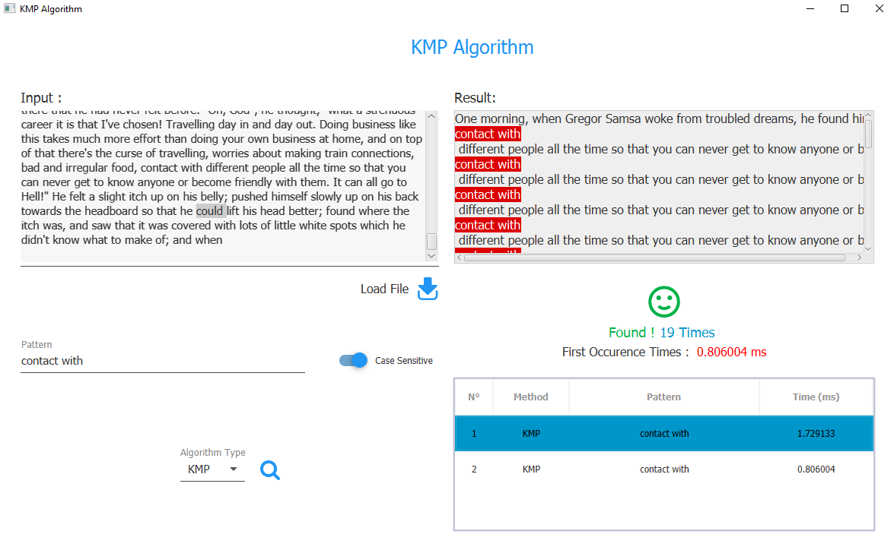
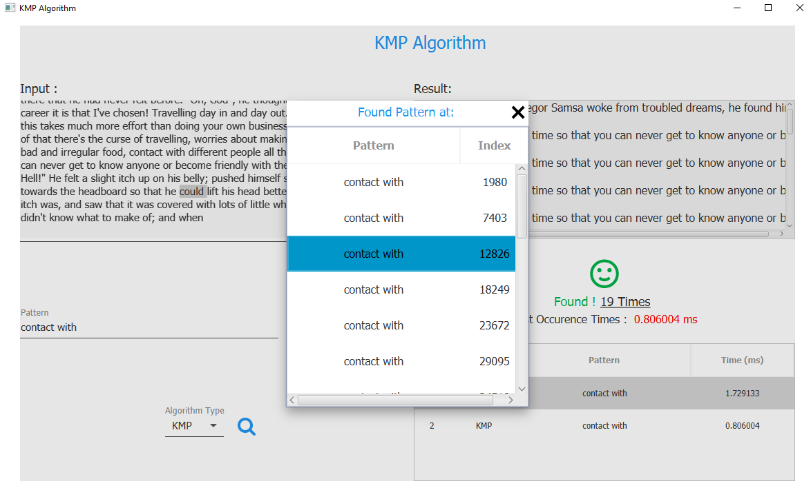

# KMP Algorithm
Algorithm complexity project

## What is KMP Algorithm ?
Knuth–Morris–Pratt string-searching algorithm (or KMP algorithm) searches for occurrences of a "word" W within a main "text string" S by employing the observation that when a mismatch occurs, the word itself embodies sufficient information to determine where the next match could begin, thus bypassing re-examination of previously matched characters. 

## History of KMP
The algorithm was conceived in 1970 by <b>Donald Knuth</b> and <b>Vaughan Pratt</b>, and independently by <b>James H. Morris</b>. This was the first linear-time algorithm for string matching

## Used libraries
* JFoenix (material design library)
* FontAwesome-Fx (icons library)

## Screenshots
| KMP Main program  |
| ------------------ |
|  |

| KMP Main program with index |
| ------------------ |
|  |

| Demo Graph for demonstration time of KMP Algorithm time vs Brute Force Algorithm time |
| ------------------ |
|  |
